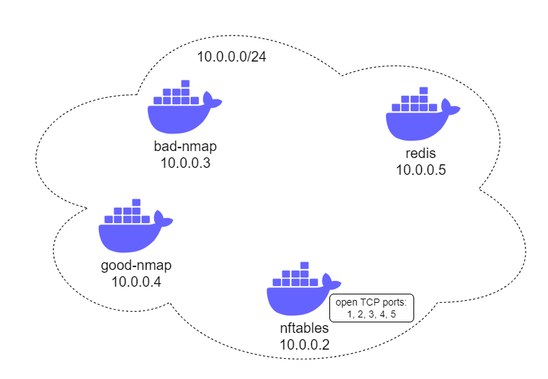

# 1. Introduction

Moving Target Defence (MTD) is an active defence principle that is focued on dynamic attack surface modifications.

The following project is a PoC that shows how the MTD could be implemented.

# 2. How does it work?
The implementation of the MTD consists of the following questions' answers:
- What? -> specifies what part of attack surface will be dymanically modified,
- How? -> specifies how the dynamic modifications will be applied,
- When? -> specifies when the dynamic modification will be applie.

The answers are as follows:
- What? - services` locations (port numbers),
- How? - nftables rules that redirect network traffic, 
- When? - every T seconds, where ```L <= T <= U```, L and U are provided at program startup.

# 3. Architecture
The PoC consists of three docker containers: \


`nmap` container is used to scan the network, namely `nftables` container. 
`nftables` container hosts the PoC that applies [nftables](https://wiki.nftables.org/wiki-nftables/index.php/Main_Page) rules to redirect network traffic and mislead adversaries (`nmap` container). `nftables` container also hosts an application that is able to send messages to the `redis` container. The PoC subscribes redis topic and each message triggers nftables rules application. Moreover, the `nftables` container has 5 open tcp ports: 1, 2, 3, 4 and 5. 

# 4. Test the solution

To test the solution a linux machine with installed docker compose is required.

## 4.1 Run PoC

Open first terminal and run:
```
sudo docker-compose up
```

`nmap` container exited immediately but we will take care of it in a moment.

## 4.2 Nmap

Open second terminal and run:
```
sudo docker-compose run nmap
```

`nmap` container has [Nmap](https://nmap.org/) tool installed - powerful network discovery tool.

From inside the `nmap` container run the [SYN](https://nmap.org/book/synscan.html) scan against `nftables` container, ports 1...20:
```
nmap -sS 10.0.0.2 -p1-20
```
or
```
nmap -sS nftables -p1-20
```
Both IP and container name (`nftables`) are valid as communication within a docker network could be done by using containers names. Output should look like this: \


As you can see the scan tells us that there are 5 TCP ports open: 1, 2, 3, 4 and 5.

## 4.3 Nftables

Open third terminal and run:
```
sudo docker-compose exec nftables bash
```

`nftables` (as mentioned in the [architecture](Architecture) section), has a python app that is able to send messages to the `redis` container. To send a single message run:
```
python3 -m redis-message-launcher.main -r 10.0.0.4
```
or
```
python3 -m redis-message-launcher.main -r redis
```
Once you send the message, you should see that the `nftables` container received the message (first terminal). Receiving the message means that the nftables rules has been applied. To verify let's run the SYN scan one more time (second terminal - `nmap` container):
```
nmap -sS nftables -p1-20
```


This time the scan tells us that there are 5 ports open: 1, 2, 6, 10, 16 (in your case the open ports apart from 1 and 2 will probably differ as they are randomly chosen). It means that nftables rules has been applied and the network traffic is redirected according to the PoC logic.

Let's run another message (third terminal - `nftables` container
```
python3 -m redis-message-launcher.main -r redis
```

and SYN scan one more time (second terminal - `nmap` container):

```
nmap -sS nftables -p1-20
```
You should see that the ports (apart from port 1 and 2) are moving!

## 4.4 Automate messages sending
Insted of sending messages one by one you can run python app and send messages in intervals (third container - `nftables` container):
```
python3 -m redis-message-launcher.main -l 20 -u 25 -r redis
```
These additional `-l` and `-u` params mean that messages will be sent every T seconds, where ```l <= T <= u```. To interrupt the program just CTRL+C (ignore an error...).

## 4.5 Other scans
The PoC can mislead other types of Nmap TCP scans:
- [FIN](https://nmap.org/book/scan-methods-null-fin-xmas-scan.html),
- [NULL](https://nmap.org/book/scan-methods-null-fin-xmas-scan.html),
- [XMAS](https://nmap.org/book/scan-methods-null-fin-xmas-scan.html),
- [Connect Scan](https://nmap.org/book/scan-methods-connect-scan.html).

To run the scans simply replace `-sS` in Nmap commands with the following:
- FIN -> `-sF`,
- NULL -> `-sN`,
- XMAS -> `-sX`,
- Connect Scan -> `-sT` (Don't worry if the first terminal prints errors for this scan - that's because the scan immediately terminates the established connection. The PoC and open ports should work fine.).

## 4.6 Kill the PoC
Once you test the PoC you can stop the containers by closing the terminals and run:
```
sudo docker-compose down -v
```